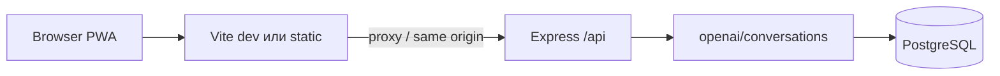

# AstroBot — контекст проекта для разработки (Claude Code / IDE)

Документ описывает монорепозиторий **AstroBot**: продукт, стек, структуру пакетов, потоки данных, API, БД, биллинг, чат и астродвижок. Секреты и значения переменных окружения **не** приводятся — только имена и назначение.

**См. также:** устаревшие или узкие детали в [`replit.md`](../replit.md) (там может быть упоминание только GPT; фактически чат см. раздел LLM ниже). Источник контрактов API: [`lib/api-spec/openapi.yaml`](../lib/api-spec/openapi.yaml).

---

## Оглавление

1. [Кратко о продукте](#1-кратко-о-продукте)
2. [Монорепозиторий и стек](#2-монорепозиторий-и-стек)
3. [Пакеты и роли](#3-пакеты-и-роли)
4. [Запуск и сборка](#4-запуск-и-сборка)
5. [Архитектура runtime](#5-архитектура-runtime)
6. [Аутентификация и сессия](#6-аутентификация-и-сессия)
7. [База данных](#7-база-данных)
8. [Чат, system prompt и LLM](#8-чат-system-prompt-и-llm)
9. [Биллинг и запросы](#9-биллинг-и-запросы)
10. [Контакты и UI чата](#10-контакты-и-ui-чата)
11. [Астрологический движок](#11-астрологический-движок)
12. [Переменные окружения](#12-переменные-окружения)
13. [Codegen OpenAPI](#13-codegen-openapi)
14. [Тесты и e2e](#14-тесты-и-e2e)
15. [Ограничения и подводные камни](#15-ограничения-и-подводные-камни)
16. [UI-фундамент и UX (Tailwind)](#16-ui-фундамент-и-ux-tailwind)

---

## 1. Кратко о продукте

**AstroBot** — PWA-приложение с диалоговым AI-астрологом. Пользователь задаёт вопросы в чате; сервер собирает натальные данные, транзиты, при необходимости синастрию с контактами и отдаёт потоковый ответ (SSE).

Ключевые возможности:

- Профиль пользователя (дата/время/место рождения, тон общения, аватар JSON и др.).
- **Контакты** (другие люди): для режима пары включаются натал контакта, транзиты к его наталу, синастрия с пользователем.
- **База / расширение по контакту:** в расширенном режиме в промпт добавляются соляр, прогрессии, лунар, солнечная дуга, даты точных транзитов по контакту; списание «запросов» выше (см. [§9](#9-биллинг-и-запросы)).
- **Память** (краткие факты из диалога, отдельная таблица).
- **Оплата** пакетов запросов через **ЮKassa** (рубли); бесплатная квота настраивается env.
- Опционально **Яндекс OAuth** и JWT (см. [§6](#6-аутентификация-и-сессия)).

---

## 2. Монорепозиторий и стек

| Компонент | Версии / выбор |
|-----------|----------------|
| Менеджер пакетов | **pnpm** (workspaces) |
| Node | ориентир **24** (см. `replit.md`) |
| TypeScript | **~5.9** |
| Фронтенд | **React 19**, **Vite 7**, Tailwind 4, TanStack Query |
| API | **Express 5** |
| БД | **PostgreSQL**, **Drizzle ORM** |
| Валидация / codegen | Zod, Orval из OpenAPI |
| LLM (чат) | **Anthropic Claude** по умолчанию; при отсутствии ключа — **OpenAI** (fallback) |

Файл workspace: [`pnpm-workspace.yaml`](../pnpm-workspace.yaml) — пакеты в `artifacts/*`, `lib/*`, `scripts`.

---

## 3. Пакеты и роли

| Путь | Назначение |
|------|------------|
| [`artifacts/astrobot`](../artifacts/astrobot) | SPA/PWA: страницы (Onboarding, Chat, Home), компоненты чата, `use-chat-stream`, сессия в `session.ts` |
| [`artifacts/api-server`](../artifacts/api-server) | HTTP API под префиксом `/api`, астродвижок [`src/lib/astrology.ts`](../artifacts/api-server/src/lib/astrology.ts), маршруты в `src/routes/` |
| [`lib/db`](../lib/db) | `DATABASE_URL`, Drizzle-схемы, `runDbMigrations` |
| [`lib/api-spec`](../lib/api-spec) | `openapi.yaml`, скрипт codegen (Orval) |
| [`lib/api-client-react`](../lib/api-client-react) | Сгенерированные хуки/клиент для фронта |
| [`lib/api-zod`](../lib/api-zod) | Сгенерированные Zod-схемы |
| [`lib/integrations-openai-ai-server`](../lib/integrations-openai-ai-server) | OpenAI SDK-обёртка (ключи `OPENAI_API_KEY` / `AI_INTEGRATIONS_*`) |
| [`lib/integrations-anthropic-ai`](../lib/integrations-anthropic-ai) | Клиент Anthropic |
| [`scripts`](../scripts) | В т.ч. e2e-smoke |

---

## 4. Запуск и сборка

Минимальные требования для API: **`PORT`**, **`DATABASE_URL`**. Для чата в проде нужен хотя бы один провайдер LLM (**Anthropic** или **OpenAI**).

Примеры (из [`replit.md`](../replit.md), уточняйте под свою среду):

```bash
pnpm --filter @workspace/api-spec run codegen    # после правок openapi.yaml
pnpm --filter @workspace/db run push              # схема БД (drizzle)
pnpm --filter @workspace/api-server run dev       # API
pnpm --filter @workspace/astrobot run dev         # фронт (нужен PORT в env для vite.config)
```

Корневой `pnpm run typecheck` / `pnpm run build` — см. [`package.json`](../package.json).

---

## 5. Архитектура runtime



- В **production** при `NODE_ENV=production` Express отдаёт собранный фронт из каталога `FRONTEND_DIST` или по умолчанию `artifacts/astrobot/dist/public` — см. [`artifacts/api-server/src/app.ts`](../artifacts/api-server/src/app.ts). SPA fallback и OG-meta: [`spaHtml.ts`](../artifacts/api-server/src/lib/spaHtml.ts).
- Роутер API: [`artifacts/api-server/src/routes/index.ts`](../artifacts/api-server/src/routes/index.ts) — health, auth, users, openai (conversations + daily-forecast), astrology, contacts, billing, admin.

---

## 6. Аутентификация и сессия

- [`artifacts/api-server/src/middleware/auth.ts`](../artifacts/api-server/src/middleware/auth.ts): в `req.sessionId` попадает либо **JWT** (`Authorization: Bearer`), либо заголовок **`x-session-id`** (анонимная/legacy-сессия).
- Клиент хранит session id и при необходимости токен — [`artifacts/astrobot/src/lib/session.ts`](../artifacts/astrobot/src/lib/session.ts).
- Яндекс OAuth и JWT: [`artifacts/api-server/src/routes/auth.ts`](../artifacts/api-server/src/routes/auth.ts) (`JWT_SECRET`, `YANDEX_*`, `OAUTH_REDIRECT_BASE_URL`).

---

## 7. База данных

Подключение: [`lib/db/src/index.ts`](../lib/db/src/index.ts). Миграции idempotent-SQL: [`lib/db/src/migrations.ts`](../lib/db/src/migrations.ts), вызываются при старте API ([`artifacts/api-server/src/index.ts`](../artifacts/api-server/src/index.ts)).

| Таблица | Файл схемы | Назначение |
|---------|------------|------------|
| `users` | [`schema/users.ts`](../lib/db/src/schema/users.ts) | `session_id` (unique), профиль, `requests_balance` / `requests_used`, onboarding, тон, аватар |
| `conversations` | [`schema/conversations.ts`](../lib/db/src/schema/conversations.ts) | Диалоги; `contact_id`, **`contact_extended_mode`** |
| `messages` | [`schema/messages.ts`](../lib/db/src/schema/messages.ts) | Сообщения чата, FK на `conversations` |
| `contacts` | [`schema/contacts.ts`](../lib/db/src/schema/contacts.ts) | Контакты пользователя (синастрия) |
| `user_memories` | [`schema/memories.ts`](../lib/db/src/schema/memories.ts) | Краткая память по `session_id` |
| `payments` | [`schema/payments.ts`](../lib/db/src/schema/payments.ts) | Платежи ЮKassa, начисление кредитов |

---

## 8. Чат, system prompt и LLM

Основной файл: [`artifacts/api-server/src/routes/openai/conversations.ts`](../artifacts/api-server/src/routes/openai/conversations.ts).

- **`calcUserData(user)`** — натал пользователя, эфемериды, соляр, прогрессии, лунар, солнечная дуга, даты транзитов и т.д.
- При выбранном **контакте**: **`calcContactChartSections`**, синастрия (`calcSynastry`), тексты режимов база/расширение в `buildSystemPrompt`.
- **Память:** последние записи из `user_memories` попадают в промпт; после ответа — фоновое извлечение фактов через **Haiku** (`ANTHROPIC_MEMORY_MODEL`).
- **Финал ответа:** в `buildSystemPrompt` заданы правила «хвоста» — только астрологический мостик (планета/дом/транзит и т.д.), без коучинговых опросников («застой/смена/конфликт» и т.п.); иначе лучше закончить без вопроса.
- **Стриминг:** `text/event-stream`, SSE chunks.
- **Модели:**
  - Если задан ключ Anthropic (`ANTHROPIC_API_KEY` или `AI_INTEGRATIONS_ANTHROPIC_API_KEY`) — чат идёт в **Claude** (`ANTHROPIC_CHAT_MODEL`, по умолчанию `claude-sonnet-4-6`).
  - Иначе — **OpenAI** (`OPENAI_CHAT_MODEL`, по умолчанию `gpt-4o-mini`) через `@workspace/integrations-openai-ai-server`.
- **Ежедневный прогноз:** отдельный роут [`daily-forecast.ts`](../artifacts/api-server/src/routes/openai/daily-forecast.ts), модель `ANTHROPIC_FORECAST_MODEL` или fallback на memory model.

Итог: документ `replit.md`, где указан только GPT-5.2, для чата **не является единственным источником истины** — ориентируйтесь на `conversations.ts` выше.

---

## 9. Биллинг и запросы

- Политика: [`artifacts/api-server/src/lib/billing-policy.ts`](../artifacts/api-server/src/lib/billing-policy.ts) — бесплатная квота `FREE_REQUESTS_QUOTA` (env), безлимит по email `UNLIMITED_REQUEST_EMAILS`.
- Списание за сообщение в чате — в `POST .../messages`: базовая стоимость **1** (короткое) или **2** (длина ≥ 1200 символов); при **контакте + расширенном режиме** — **2** (короткое) или **3** (длинное), не 4.
- Пакеты ЮKassa: [`artifacts/api-server/src/routes/billing.ts`](../artifacts/api-server/src/routes/billing.ts); идемпотентность/антиспам могут использовать **Upstash Redis** (`UPSTASH_REDIS_*`, опционально).

---

## 10. Контакты и UI чата

- API: CRUD [`artifacts/api-server/src/routes/contacts.ts`](../artifacts/api-server/src/routes/contacts.ts).
- UI: `PeoplePanel`, `AddContactModal`, страница [`Chat.tsx`](../artifacts/astrobot/src/pages/Chat.tsx), стрим [`use-chat-stream.ts`](../artifacts/astrobot/src/hooks/use-chat-stream.ts).
- В тело каждого сообщения уходит **`contactExtendedMode`** (boolean), плюс при выборе контакта — `contactId`, чтобы сервер синхронизировал биллинг и промпт с чекбоксом «углубить разбор».

---

## 11. Астрологический движок

Единый крупный модуль: [`artifacts/api-server/src/lib/astrology.ts`](../artifacts/api-server/src/lib/astrology.ts) — натал, дома, аспекты, транзиты, синастрия, соляр, прогрессии, лунар, солнечная дуга, часть продвинутых техник. Для точного списка экспортов и форматов смотрите файл и маршруты [`artifacts/api-server/src/routes/astrology.ts`](../artifacts/api-server/src/routes/astrology.ts).

---

## 12. Переменные окружения

### API-сервер (основное)

| Переменная | Назначение |
|------------|------------|
| `PORT` | Порт HTTP (**обязательно** при старте) |
| `DATABASE_URL` | PostgreSQL connection string (**обязательно** для БД) |
| `NODE_ENV` | `production` — раздача статики фронта, поведение логгера |
| `FRONTEND_DIST` | Путь к `dist` фронта (override для Railway и т.п.) |
| `LOG_LEVEL` | Уровень логов pino |

**LLM (чат)**

| Переменная | Назначение |
|------------|------------|
| `ANTHROPIC_API_KEY` / `AI_INTEGRATIONS_ANTHROPIC_API_KEY` | Ключ Anthropic (предпочтительно для чата) |
| `ANTHROPIC_CHAT_MODEL` | Модель чата (default `claude-sonnet-4-6`) |
| `ANTHROPIC_MEMORY_MODEL` | Модель извлечения памяти (default `claude-haiku-4-5`) |
| `OPENAI_CHAT_MODEL` | Fallback чата OpenAI |
| `OPENAI_API_KEY` / `AI_INTEGRATIONS_OPENAI_API_KEY` | Ключ OpenAI |
| `AI_INTEGRATIONS_OPENAI_BASE_URL` | Необязательный base URL OpenAI |

**Прогноз дня**

| Переменная | Назначение |
|------------|------------|
| `ANTHROPIC_FORECAST_MODEL` | Модель для daily forecast (fallback на memory model) |

**OAuth / админ**

| Переменная | Назначение |
|------------|------------|
| `JWT_SECRET` | Подпись JWT (в dev есть небезопасный default) |
| `YANDEX_CLIENT_ID` / `YANDEX_CLIENT_SECRET` | Яндекс OAuth |
| `OAUTH_REDIRECT_BASE_URL` | База redirect URI |
| `ADMIN_EMAILS` | Список email для admin routes |

**Биллинг**

| Переменная | Назначение |
|------------|------------|
| `YOOKASSA_SHOP_ID` / `YOOKASSA_SECRET_KEY` | ЮKassa REST (**обязательно** для создания платежей) |
| `YOOKASSA_API_BASE_URL` | Обычно default API v3 |
| `YOOKASSA_TIMEOUT_MS` | Таймаут HTTP |
| `UPSTASH_REDIS_REST_URL` / `UPSTASH_REDIS_REST_TOKEN` | Опционально для throttling и т.п. |

**Квоты**

| Переменная | Назначение |
|------------|------------|
| `FREE_REQUESTS_QUOTA` | Число бесплатных «запросов» до списания баланса |
| `UNLIMITED_REQUEST_EMAILS` | Список email без лимита |

**OG / публичный URL (SSR meta для SPA)**

| Переменная | Назначение |
|------------|------------|
| `VITE_PUBLIC_ORIGIN` / `PUBLIC_ORIGIN` | Канонический origin для og:image |
| `VERCEL_URL`, `CF_PAGES_URL`, `RAILWAY_PUBLIC_DOMAIN`, `URL` (Netlify), `RENDER_EXTERNAL_URL` | Авто-детект origin на хостингах |
| `BASE_PATH` | Префикс пути приложения |
| `OG_IMAGE_CACHE_KEY` | Версионирование кэша og image |

### Vite / фронт (сборка)

См. [`artifacts/astrobot/vite.config.ts`](../artifacts/astrobot/vite.config.ts): `PORT`, `BASE_PATH`, `VITE_PUBLIC_ORIGIN`, те же хостинговые URL для OG.

| Переменная | Назначение |
|------------|------------|
| `VITE_API_BASE_URL` | Базовый URL API (см. `main.tsx`) |
| `VITE_ENABLE_BILLING_TEST` | Флаг в `App.tsx` для тестов биллинга |

### E2E

| Переменная | Назначение |
|------------|------------|
| `E2E_BASE_URL` | База для [`scripts/e2e/smoke-chat-billing.mjs`](../scripts/e2e/smoke-chat-billing.mjs) |

---

## 13. Codegen OpenAPI

После изменений в [`lib/api-spec/openapi.yaml`](../lib/api-spec/openapi.yaml):

```bash
pnpm --filter @workspace/api-spec run codegen
```

Генерируются клиент React Query и Zod-схемы. Ручные правки в `lib/api-client-react/src/generated/*` при следующем codegen перезапишутся.

---

## 14. Тесты и e2e

- Скрипт: `pnpm run test:e2e:smoke` → [`scripts/e2e/smoke-chat-billing.mjs`](../scripts/e2e/smoke-chat-billing.mjs) — создание диалога, SSE, health (проверьте `E2E_BASE_URL`).
- Корневой `typecheck`: `pnpm run typecheck`.

---

## 15. Ограничения и подводные камни

1. **`replit.md`** удобен как обзор, но **устаревает** по части LLM (в коде приоритет Anthropic для чата).
2. **Сессия и контакт:** если в БД у диалога висит `contact_id`, а пользователь в UI переключился на «Я», возможна рассинхронизация до следующего сообщения с явной привязкой — логика исправляется на сервере/клиенте осторожно.
3. **`FRONTEND_DIST` и CWD** на Railway: см. комментарии в `app.ts`.
4. **ЮKassa:** без `YOOKASSA_*` создание платежа упадёт; Redis для billing опционален.
5. **Секреты:** не коммитить `.env`; в документации только имена переменных.

---

## 16. UI-фундамент и UX (Tailwind)

Отдельный «слой» вроде внешних шаблонов ArchitectUX (отдельные `design-system.css`, vanilla theme-manager) **не вводим** — единый источник внешнего вида здесь: **Tailwind 4** + токены в [`artifacts/astrobot/src/index.css`](../artifacts/astrobot/src/index.css) (`@theme inline`, семантические цвета через `--background`, `--primary`, `--card` и т.д.). Новые экраны и компоненты опираются на эти классы и переменные, а не на параллельную систему имён.

**Макет и переписка**

- Колонка под чат: `flex-1 min-h-0` у цепочки flex-родителей, у области сообщений — **`min-w-0`**, **`overflow-x-hidden`** и вертикальный скролл, чтобы длинный markdown/код не раздувал ширину и не «уезжало» всё окно.
- Пузыри: ограничение ширины (`max-w-*`), **`break-words`**, у блоков кода в markdown — горизонтальный скролл внутри пузыря (`overflow-x-auto` на `pre`), а не у всей страницы.
- После отправки сообщения выравнивание скролла — в [`Chat.tsx`](../artifacts/astrobot/src/pages/Chat.tsx) (один проход при появлении пары user+assistant, без подгона на каждый чанк стрима).

**Доступность (минимум для новых фич)**

- Интерактивы: видимый **focus** (`focus-visible`, кольцо/контраст), для иконок-кнопок — **`aria-label`** там, где нет текста.
- Контраст текста и кнопок — ориентир **WCAG 2.1 AA** (нормальный текст ~4.5:1 к фону, крупный — проще) на типичных сочетаниях (`bg-card`, градиенты кнопок, `muted-foreground`).
- Не полагаться только на цвет для состояния (дублировать подписью, иконкой или текстом ошибки).
- Зоны нажатия на тач: по возможности не меньше **~44×44 px** (или визуально меньше кнопка + достаточный `padding` у hit-area).
- Анимации и микродвижения: учитывать **`prefers-reduced-motion`** — при `reduce` ослаблять или отключать не существенное.

**Согласованность (типографика и отступы)**

- Вертикальный ритм и отступы — через **шкалу Tailwind** (`gap-*`, `p-*`, `space-y-*`), без произвольных «один раз на экране» пикселей, если нет веской причины.
- Иерархия заголовков/текста — существующие **`font-display` / `font-sans`** и размеры из утилит (`text-sm`, `text-base` и т.д.); новые экраны не вводят третий шрифт без обсуждения.

**Состояния компонентов**

- Интерактивные элементы явно проектируются в состояниях **по умолчанию, hover/focus, disabled, loading** (спиннер/skeleton/блокировка кнопки), **ошибка валидации** — понятный текст рядом с полем, не только цвет.
- Внешние шаблоны вроде полного «UI Designer deliverable» с отдельными глобальными `.btn`/`.card` **не дублируем** — те же принципы реализуются через **компоненты React + Tailwind** и токены в `index.css`.

**Тема:** сейчас задана тёмная палитра в `:root`; отдельный переключатель light/dark/system в продукте не зафиксирован — при добавлении расширять **`index.css`** и компоненты, а не заводить второй набор глобальных CSS-файлов.

---

*Документ сгенерирован для импорта в Claude Code и обновляется вместе с репозиторием.*
